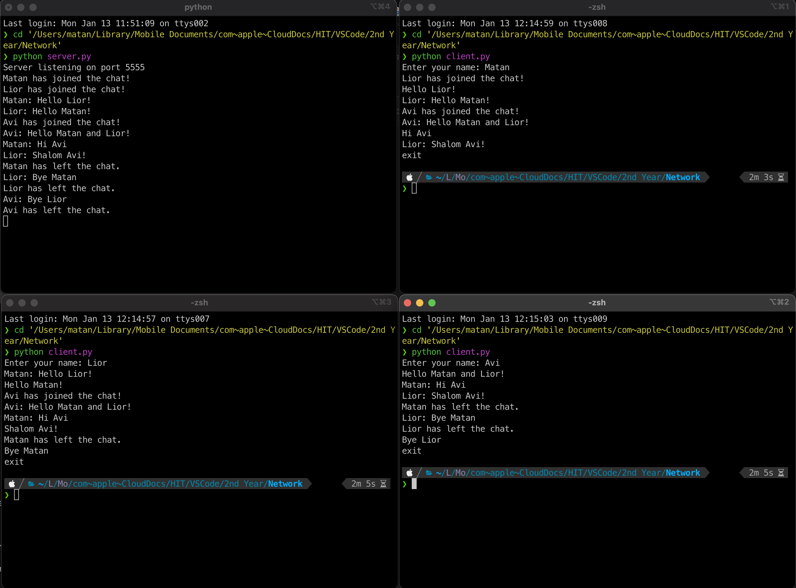

# 🗨️ Group Chat Application in Python

This is a group chat application based on Python sockets. It allows multiple clients to connect to a server and communicate with each other in real-time. Each client is assigned a name upon connection, and all messages are saved to a text file.

---

## 🧰 Requirements

- Python 3.x

---

## ⚙️ Installation

1. Download the files or clone the repository.
2. Make sure you have Python 3 installed.
3. No additional libraries are required — the app uses the built-in `socket` and `threading` modules.

---

## 📁 Files

- `server.py`: The server file — handles client connections and message broadcasting.
- `client.py`: The client file — allows users to connect to the server and join the chat.
- `chat_history.txt`: A log file where all chat messages are stored.

---

## ▶️ Running the Application

### Step 1: Start the Server

1. Open a terminal window and navigate to the directory containing `server.py`.
2. Run the server using the following command:

   ```bash
   python server.py

The server will start listening for connections on port 5555.

---

### Step 2: Start the Clients

1. Open a **new terminal window** for each client that wants to join the server.

2. Navigate to the directory containing `client.py`.

3. Start the client using the command:

   ```bash
   python client.py
   ```

4. Upon launch, you'll be prompted to enter a unique name for the client. After that, you can start chatting.

---

### 💬 Chat Instructions

* Type a message and press Enter to send it to all connected clients.
* Type `exit` to leave the chat.

---

### 📝 Chat Log

* All messages are saved to the file `chat_history.txt`, located in the same directory as `server.py`.

---

## ⚠️ Notes

* Make sure the server is running **before** launching the clients.
* If a client disconnects unexpectedly, the server will handle the disconnection and remove the client from the active user list.




# אפליקציית צ'אט קבוצתי ב-Python

אפליקציה זו היא אפליקציית צ'אט קבוצתי המבוססת על סוקטים ב-Python. האפליקציה מאפשרת למספר לקוחות להתחבר לשרת ולשוחח זה עם זה בזמן אמת. לכל לקוח מוקצה שם בתחילת החיבור, וכל ההודעות נשמרות בקובץ טקסט.

## דרישות

- Python 3.x

## התקנה

1. הורידו את הקבצים או שכפלו את המאגר.
2. ודאו כי מותקנת אצלכם גרסה 3 של Python.
3. אין צורך בספריות נוספות, האפליקציה משתמשת במודולים המובנים `socket` ו-`threading`.

## קבצים

- `server.py`: הקובץ של השרת, מטפל בחיבורי לקוחות ומשדר הודעות.
- `client.py`: הקובץ של הלקוח, מאפשר ללקוחות להתחבר לשרת ולהשתתף בצ'אט.
- `chat_history.txt`: קובץ יומן שבו נשמרות כל ההודעות בצ'אט.

## הפעלת האפליקציה

### שלב 1: הפעלת השרת

1. פתחו חלון טרמינל ונווטו לתיקייה שבה נמצא הקובץ `server.py`.
2. הפעילו את השרת עם הפקודה הבאה:

   ```bash
   python server.py
   ```

   השרת יתחיל להאזין לחיבורים בפורט 5555.

### שלב 2: הפעלת הלקוחות

1. פתחו חלון טרמינל חדש עבור כל לקוח שרוצה להתחבר לשרת.
2. נווטו לתיקייה שבה נמצא הקובץ `client.py`.
3. הפעילו את הלקוח עם הפקודה הבאה:

   ```bash
   python client.py
   ```


4. בעת ההפעלה, תתבקשו להזין שם ייחודי ללקוח. לאחר הזנת השם תוכלו להתחיל לשוחח.

### צ'אט

- הקלידו הודעה ולחצו Enter כדי לשלוח אותה לכל הלקוחות המחוברים.
- הקלידו `exit` כדי לצאת מהצ'אט.

### יומן

- כל ההודעות נשמרות בקובץ `chat_history.txt` שנמצא באותה תיקייה כמו הקובץ `server.py`.

## הערות

- ודאו שהשרת פעיל לפני שאתם מפעילים את הלקוחות.
- אם לקוח מתנתק באופן בלתי צפוי, השרת יטפל בניתוק ויסיר את הלקוח מרשימת הלקוחות הפעילים.

